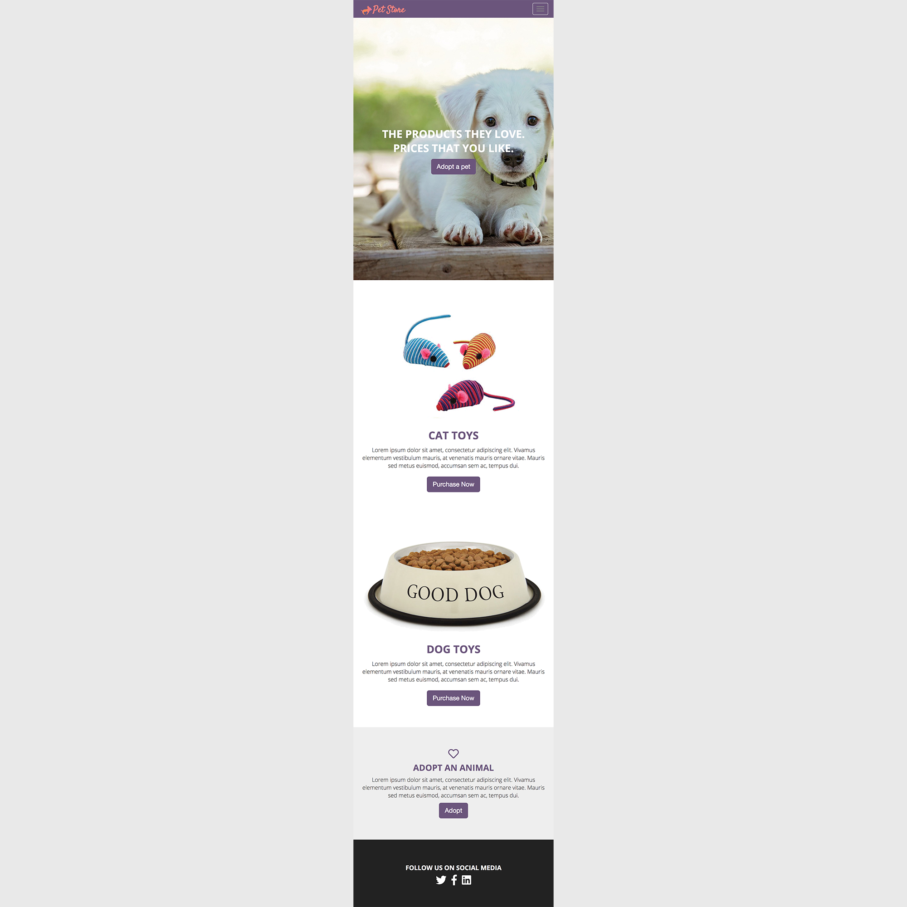
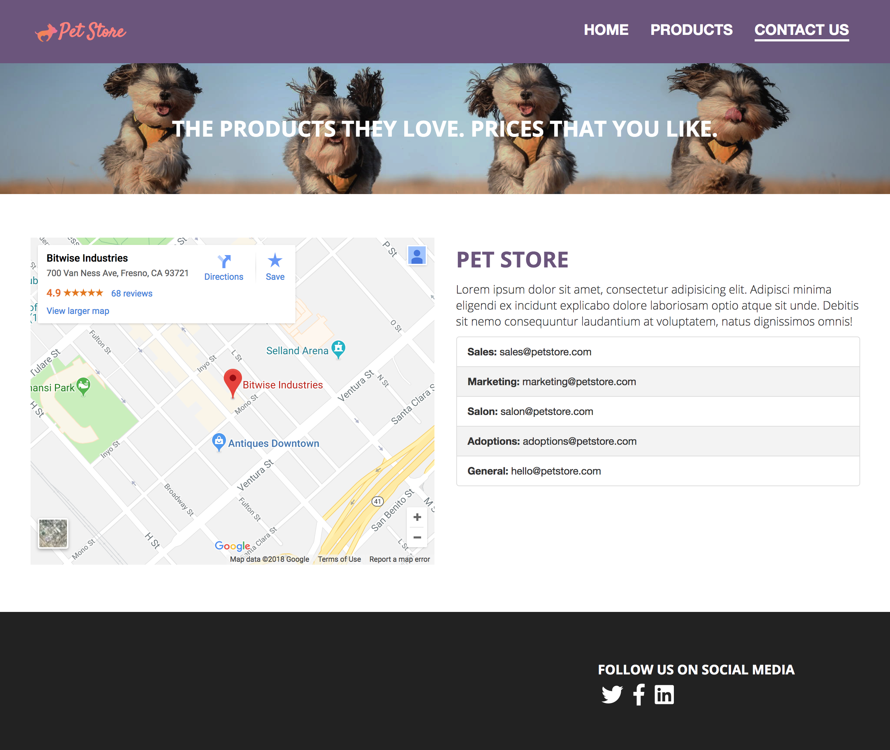
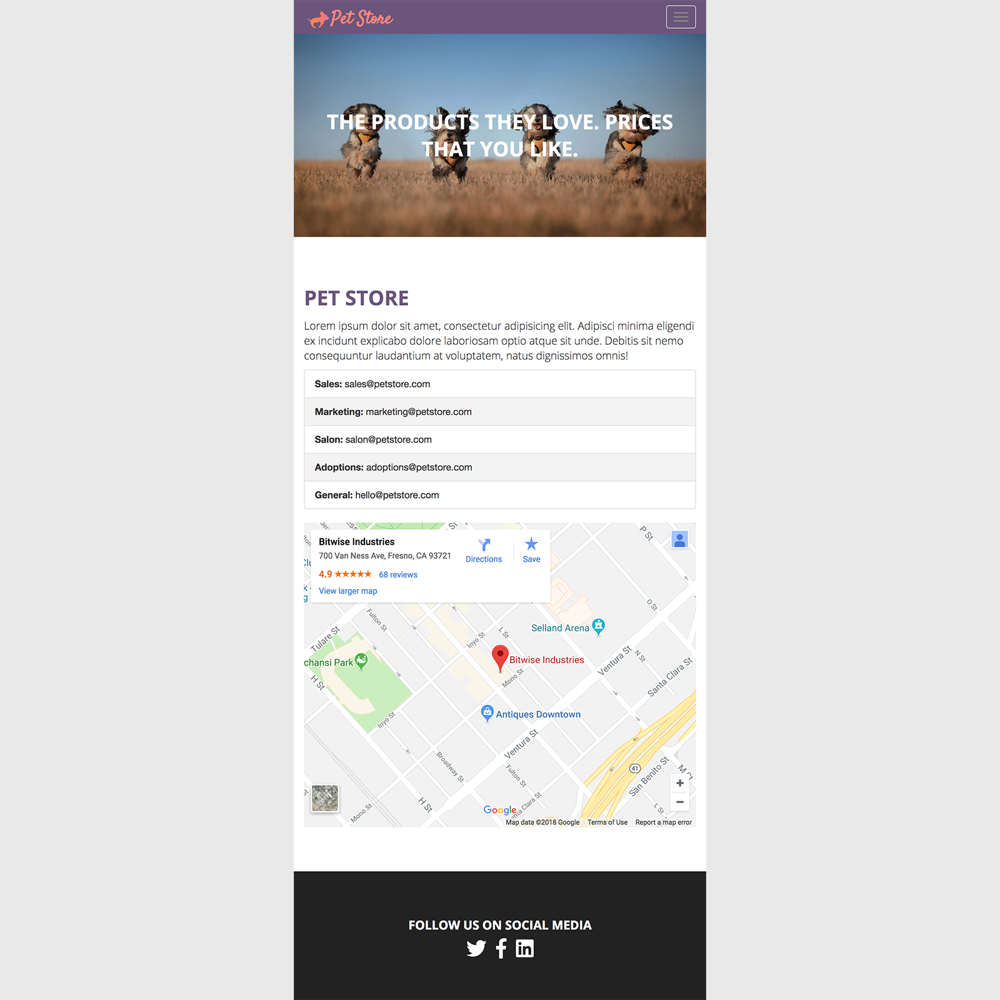

# petstore-2018-boilerplate
Includes all the necessary files needed to get started on this assignment. This exercise helps the student practice getting used to structuring html using the bootstrap framework and styling using built-in bootstrap classes,media query, and a little css. Some default presets styles are added into the styles.css to help lessen css code needed by the student.

# Part 2
Take the layout you have created from part one of this assignment and stylize the page css to your personality. Feel free replace the background images with ones you find on the web. Try to practice taking control of the bootstrap styles without altering the core bootstrap files. Add classes as necessary.

# Index Page

## This is how it should look on medium and large screens
<figure>
    
</figure>

## This is how it should look on extra-small and small screens
<figure>
    
</figure>

# Contact Page

## This is how it should look on medium and large screens
<figure>
    
</figure>

## This is how it should look on extra-small and small screens
<figure>
    
</figure>
